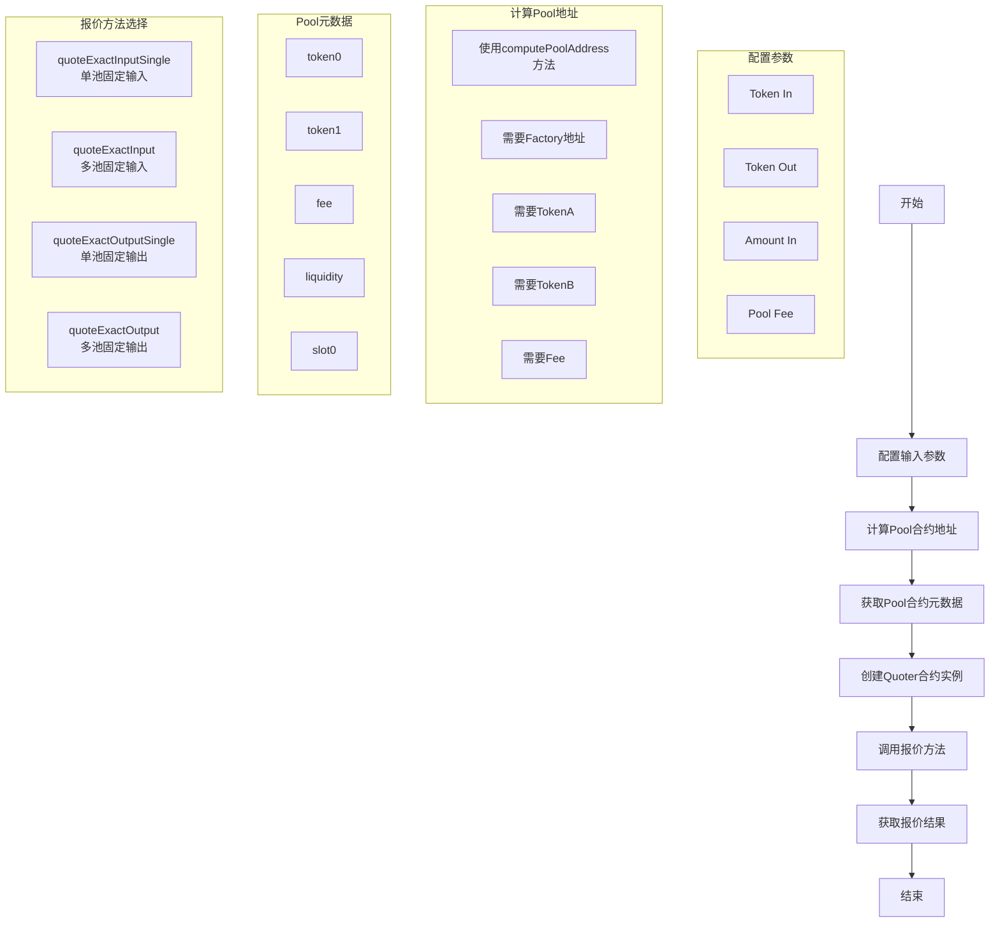

```mermaid
flowchart TD
    A[开始] --> B[配置输入参数]
    B --> C[计算Pool合约地址]
    
    subgraph 配置参数
        B1[Token In]
        B2[Token Out] 
        B3[Amount In]
        B4[Pool Fee]
    end
    
    subgraph 计算Pool地址
        C1[使用computePoolAddress方法]
        C2[需要Factory地址]
        C3[需要TokenA]
        C4[需要TokenB]
        C5[需要Fee]
    end
    
    C --> D[获取Pool合约元数据]
    
    subgraph Pool元数据
        D1[token0]
        D2[token1]
        D3[fee]
        D4[liquidity]
        D5[slot0]
    end
    
    D --> E[创建Quoter合约实例]
    E --> F[调用报价方法]
    
    subgraph 报价方法选择
        F1[quoteExactInputSingle<br>单池固定输入]
        F2[quoteExactInput<br>多池固定输入]
        F3[quoteExactOutputSingle<br>单池固定输出]
        F4[quoteExactOutput<br>多池固定输出]
    end
    
    F --> G[获取报价结果]
    G --> H[结束]
```