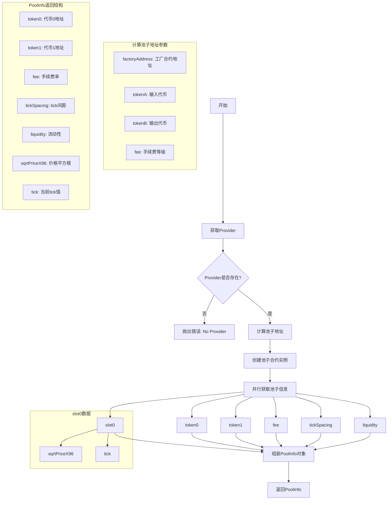
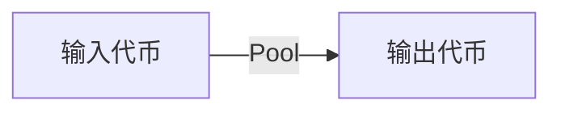
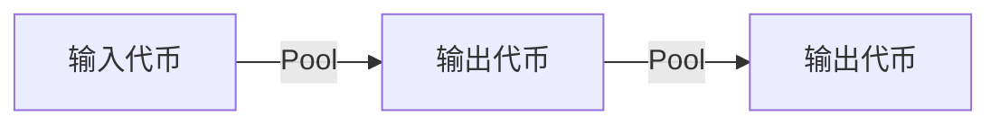
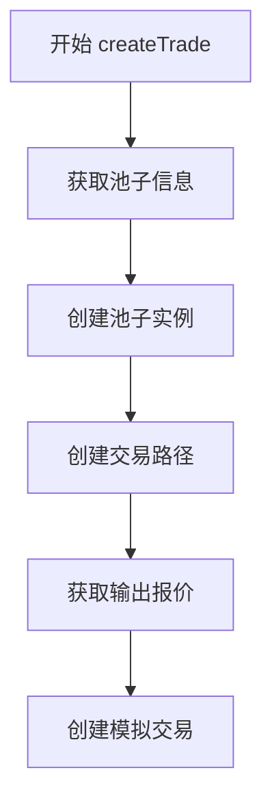
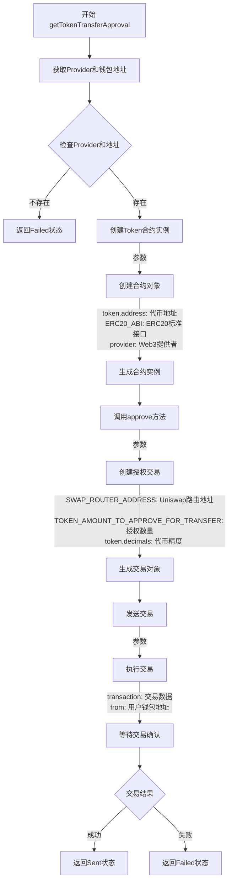
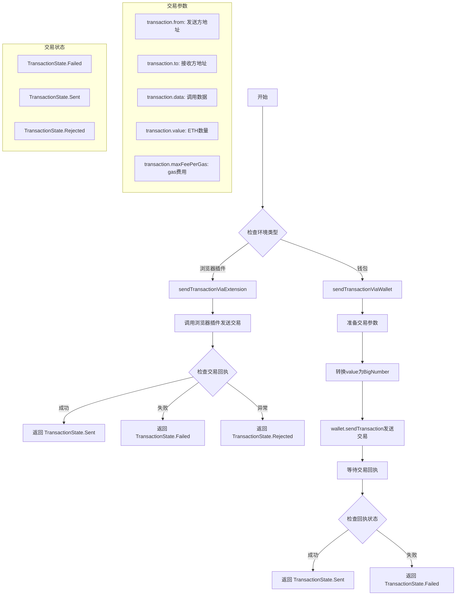

# getPoolInfo


# createTrade

## 交易路径
最佳路径考虑因素
- 流动性深度
- 价格影响
- gas 成本
- 滑点

如何理解流动性深度？
- 流动性深度是指在特定价格范围内，池子中可用于交易的代币数量。
- 流动性深度越深，表示池子中代币数量越多，交易时价格变化越小，滑点越低。

### 单条路径


### 多条路径


## 流程图


## 为什么创建不检查交易？
`checkedTrade` 和 `uncheckedTrade` 的区别：

1. **checkedTrade（检查型交易）**:
```typescript
// 检查型交易会自动进行以下步骤：
const checkedTrade = await Trade.exactIn(route, inputAmount)

// 内部执行过程：
1. 查询当前价格 -----> 链上调用
2. 计算输出金额 -----> 链上调用
3. 验证滑点    -----> 计算处理
4. 检查路径    -----> 验证处理
// 总共需要多次链上调用
```

2. **uncheckedTrade（未检查型交易）**:
```typescript
// 我们已经提前获取了输出金额
const amountOut = await getOutputQuote(route)  // 只调用一次链上接口

// 直接创建交易，不再需要额外的链上调用
const uncheckedTrade = Trade.createUncheckedTrade({
  route,
  inputAmount,
  outputAmount: amountOut,  // 直接使用已查询的金额
  tradeType
})
```

简单来说：
- `checkedTrade`: 像是去餐厅点菜，每道菜都要问价格、确认库存
- `uncheckedTrade`: 像是先看好了菜单和价格，直接下单

**为什么选择 uncheckedTrade**:
1. 性能更好：减少重复的链上调用
2. 我们已经通过 `getOutputQuote` 获取了准确的输出金额，不需要再查询

# getTokenTransferApproval


# sendTransaction
